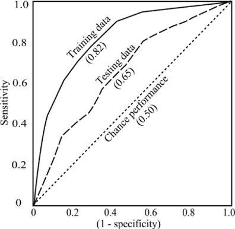

## Aprendizaje automático

* Trata de crear programas que generalizan comportamientos a través de información suministrada a base de ejemplos
* Incluye varias ramas de estudio:

    * Estadística computacional
    * Ciencias de la computación
    * Inteligencia artificial

## Tipos de algoritmos

* Aprendizaje supervisado. A la hora de entrenar, se proporcionan ejemplos que incluyen variables de entrada y su relación con la variable objetivo. El algoritmo proporciona una función que devuelve un valor de la salida en función de las entradas. Se suelen subdividir a su vez en problemas de clasificación o de regresión.
* Aprendizaje no supervisado. No existe información sobre la salida, no hay variable objetivo. El proceso de modelado se lleva a cabo utilizando únicamente las variables de entrada, y la salida debe ser etiquetada o analizada por un experto.

## Debate

* ¿Qué casos se te ocurren que se resuelvan con aprendizaje supervisado?
* ¿Y con no supervisado?
* ¿Qué problemas / retos habituales piensas que puede tener el no supervisado?

## El problema habitual

* Bajo ciertas condiciones de entrada, se observan una serie de salidas. La función que lo transforma es una caja negra, desconocida para nosotros.
* Queremos aproximar la función de la caja negra, con dos fines:

    * Predecir valores futuros
    * Conocer cómo se produce esa transformación, qué variables influyen más, cómo se relacionan entre ellas...
    
## Modelado de la solución

* Para resolver este problema, se ha evolucionado de una cultura a otra:

    * Antes, modelado de datos: principalmente, estadísticos determinando el modelo estocástico existente detrás de la generación de los datos. Las técnicas utilizadas eran la regresión lineal o logística
    * Ahora, modelado algorítmico: se presupone que los datos se generan por una distribución multivariante desconocida. Se empiezan a utilizar algoritmos para mejorar la precisión predictiva. Algunas técnicas habituales son los árboles de decisión, las SVM o las redes de neuronas
    
## Interpretabilidad versus capacidad predictiva

* Habitualmente, se mejora una de ellas empeorando la otra
* Los modelos se categorizan dependiendo de la propiedad que mejoren:

    * Caja blanca: fáciles de interpretar pero con peor capacidad predictiva. Ejemplo: árboles de decisión
    * Caja negra: difíciles de interpretar pero con mejor capacidad predictiva. Ejemplo: redes de neuronas
    
* La navaja de Occam: si un modelo más simple que otro te da una precisión similar, ¡elige el más simple!
* Habitualmente no hay una solución única para un problema, sino modelos que dan resultados similares.

## Debate

* Te presentan un proyecto de modelado predictivo. Tienes que decidir si elegir un modelado de caja blanca o de caja negra, es decir, si primar la interpretabilidad o la capacidad predictiva. Los casos son:

    * Un banco, para conceder o no un crédito a los solicitantes
    * Una agencia metereológica, para predecir la probabilidad de lluvias
    * Un médico, para recetar un medicamento en base a unos síntomas e historia clínica
    * Un e-commerce, para mostrar una oferta en base a la navegación del usuario

## Dimensionalidad

* Nos podemos encontrar casos en los que existen muchas variables de entrada. Esto usualmente implica mayor coste computacional y empeoramiento de la interpretabilidad.

## Dimensionalidad - algunas soluciones

* Consulta con experto
* Análisis propio para descartar:
    
    * Variables correlacionadas, dejando únicamente la más representativa. Ej: años de experiencia profesional versus edad
    * Variables constantes o con muy poca varianza
    * Analizar con un método que extraiga importancia de variables, y eliminar las que menos influyan. Por ejemplo, con random forests
    * Técnicas de reducción de dimensiones, como PCA. Crean un conjunto más reducido de variables que contienen la varianza del resto. Esto disminuye la interpretabilidad del modelo
    
## Sesgo versus varianza

## Sesgo versus varianza

## Sesgo versus varianza

* Soluciones a la varianza alta:

    * Más datos de entrenamiento
    * Menos variables de entrada
    
* Soluciones al alto sesgo:

    * Más variables de entrada

## Sesgo versus varianza

* Los modelos con alto sesgo y baja varianza tienden a causar underfitting
* Los modelos con bajo sesgo y alta varianza, overfitting

## Prevenir underfitting y overfitting

* Para prevenir el underfitting, elige un algoritmo con menor sesgo. Modelos como la regresión lineal suelen ser muy simples y no ajustan bien en problemas con complejidad media o alta
* Para prevenir el overfitting: separación entre conjunto de entrenamiento y test, y validación cruzada

## Distribución de los conjuntos de datos

* La finalidad del modelo es predecir lo mejor posible comportamientos futuros, no observados
* Para ello, no debemos evaluar los resultados en base a los datos con los que se ha entrenado el modelo, sino con datos que nunca ha visto
* Esto se hace separando las observaciones en dos grupos:

    * Conjunto de entrenamiento, con aproximadamente un 80% de los datos
    * Conjunto de validación, con el resto. Se utiliza para conocer de manera fiable la capacidad predictiva del modelo
    * En caso de que tengas que seleccionar el mejor modelo de varios, hay que tener un conjunto extra (p.ej. 60 - 20 - 20)

## Distribución de los conjuntos de datos

## Validación cruzada

* Es una evolución de la separación de conjuntos entre entrenamiento y validación
* Consiste en separar el conjunto de datos en K particiones y utilizar K - 1 para entrenamiento y una para test

## Distribución de los conjuntos de datos

* Cuidado, todos los conjuntos deben tener una distribución de las variables (tanto las de entrada como la objetivo) similar. La división debe ser aleatoria, manteniento estas proporciones.

## Importancia del sesgo de la muestra

* Tenemos que preocuparnos también de cómo se toma la muestra para evitar problemas de sesgo

## Debate

* ¿Qué problema de sesgo tienen los siguientes casos?

    * Elecciones EEUU de 1948 de Truman (D) contra Dewey (R). El Chicago Tribune realizó una encuesta telefónica la noche antes de las elecciones, y dio por ganador a Dewey. Ganó Truman.
    * Lanzamos una encuesta de opinión de producto vía Twitter
    * Usamos la cantidad de empresas actuales como indicador de la salud empresarial en el país

## Métricas de evaluación - Regresión

* Métricas estándar:

    * MAE (Mean Absolute Error): media de la suma de los errores (valor absoluto de la diferencia entre predicción y valor real)
    * MSE (Mean Squared Error): media de la suma de los cuadrados de los errores. Penaliza los errores "por mucho"

* En ocasiones, estas métricas no reflejan bien lo aceptables o dañinos que son los errores en nuestro caso de uso. P.ej.: si queremos predecir el nivel de contaminación

## Métricas de evaluación - Clasificación

* Métricas estándar:

    * Matriz de confusión
    

## Métricas de evaluación - Clasificación

* Precision y recall

## Métricas de evaluación - Clasificación

Otra forma de verlo:

* Precision: la aumento si únicamente marco como P aquellas observaciones sobre las que tengo mucha seguridad
* Recall: la aumento si marco como P todas las observaciones, aunque tenga muchas dudas

## Métricas de evaluación - Clasificación

* Curva ROC (Característica operativa del receptor): Ilustra la sensibilidad de un sistema binario. Una matriz de confusión es un punto de la curva ROC, dependiendo de donde pongamos el corte de decisión
* AUC (Área bajo la curva): se suele usar como medida estándar del rendimiento del modelo. El máximo teórico es 1 

## Elección del punto de corte

* Los problemas de clasificación suelen dar una respuesta que indica probabilidad de clase positiva. Por defecto, se suele elegir el 0.5 para distinguir entre el TRUE y el FALSE
* Es importante que nos planteemos si nuestros FP nos cuestan lo mismo que los FN. En caso de que no sea así, debemos evaluar los resultados y decidir el punto de corte en el mínimo coste.

## Debate

* En los siguientes casos, ¿"cuestan" lo mismo los FP que los FN? ¿Por qué?

    * Un registro al azar "trampeado" en un aeropuerto. Registro exhaustivo a los pasajeros con probabilidad de ser terroristas
    * Detección de si eres hombre (T = hombre, N = mujer) en base a contenido explorado en una web de un periódico, para mostrar una oferta u otra
    * Una entidad bancaria, que acepta o rechaza solicitudes de crédito

## Los outliers

* Los outliers son los valores extraños que se alejan del comportamiento habitual
* Habitualmente, se eliminan del entrenamiento, para no ajustar a casos aislados

## Los outliers

## Los outliers

* Cuidado, a veces no es recomendable "simplemente" quitarlos
* Su existencia puede estar causada por un motivo y hay que estudiarlo
* Por ejemplo, en predicción de ingresos
* Si por el contrario, están causados debido a un error mecánico (introducción de los datos), es recomendable descartarlos

## Valores desconocidos (NA)

* Muchos algoritmos de modelado no aceptan valores desconocidos, y es necesario imputarlos
* Cuidado, su existencia puede estar causada por un motivo. Por ejemplo, si vamos a predecir morosidad en el alquiler de un apartamento, y tenemos NAs en ingresos anuales, siendo este dato optativo (se informa si el solicitante quiere). En estos casos, aunque lo imputemos, es recomendable crear una variable con valores sí/no informando si el valor era NA.

## Valores desconocidos (NA) - Imputación

* Hay distintas formas de imputar los NAs:

    * La fácil y rápida, imputando con la mediana / moda de la columna
    * Más elaborada, si el resto de variables tienen poder predictivo sobre la columna con NAs, crear un modelo para imputar
    * Si es una serie temporal, interpolar entre valores cercanos en la serie

## Clases muy desbalanceadas

* En ocasiones, nos vamos a encontrar con problemas de clasificación en los que las clases están desbalanceadas. Es decir, hay muchas más observaciones de una que de otra. Ejemplo: impago en créditos
* Muchos modelos son sensibles a esto. Si observan más habitualmente una clase que otra, por defecto van a predecir la clase predominante.
* Para evitar esto, es recomendable:

    * Utilizar métricas adecuadas. ¿Qué pasa si solo evaluamos aciertos (sean TP o TN) cuando el desbalanceo es del 5% - 95%?
    * Equilibrar la proporción al entrenar (a un 50% - 50%)

## Creación de nuevas features

* En ocasiones podemos crear nuevos valores de entrada, calculados en base a las otras entradas, aumentando el poder predictivo del modelo
* Por ejemplo, en un caso de impago, puede que tengamos el nivel de ingresos y el nivel de gastos. Pero una métrica mejor, puede ser el nivel de endeudamiento (gastos / ingresos)

## Metodología

## Metodología

1. Leer de una o varias fuentes: BD SQL o NoSQL, ficheros de texto, APIs, ...
2. Limpiar y organizar los datos en filas de observaciones y columnas de propiedades
3. Un ciclo de:

    1. Transformar: filtrando, agrupando, calculando nuevas columnas, ...
    2. Visualizar: para comprobar de un solo vistazo cómo se distribuyen los datos, si hay variables correlacionadas, existencia de outliers, observación de patrones, ...
    3. Modelar: ajustamos un modelo a los datos de entrenamiento y evaluamos su rendimiento

4. Comunicar: no hay que olvidarse de esta parte. El cliente quiere conocer el por qué de los resultados obtenidos y hay que gestionar las expectativas de funcionamiento con él.
